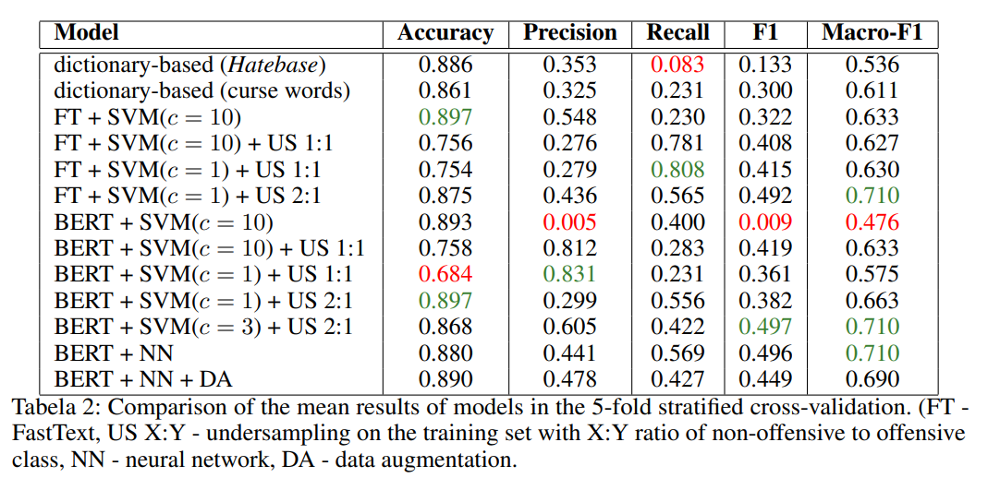
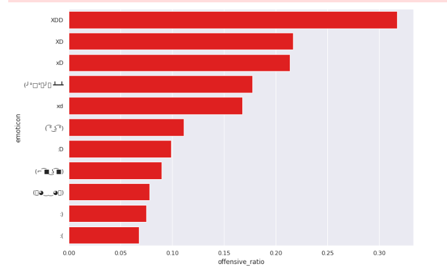
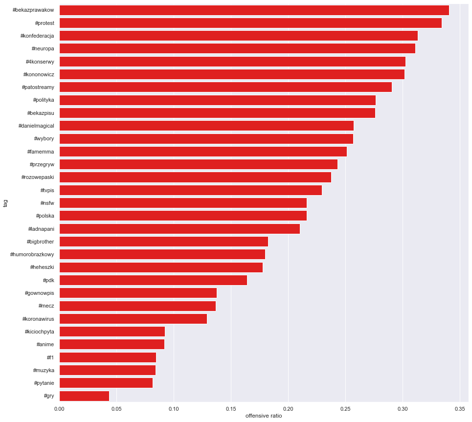

# Wykop Offensive Speech 

Repository for Data Science project done by three students: Alicja Figas, Marcin Gruza, Daria Puchalska

# Project description

The main purpose of the project was to analyze offensive speech phenomenon on polish social media service Wykop.pl and build a machine learning model for automatic offensive speech recognition.

# Project stages

## Data acquisition

The data was fetched with Wykop API. We collected 500,000+ entries and comments from Wykop "Mikroblog", and selected 6,000 comments from most active users.

## Annotation

Selected comments were annotated as offensive or not. Each comment was annotated by all three authors of this project. The final label was selected by majority voting. 10.75 % of comments are annotated as offensive.

The annotated dataset is available under `annotations/data/classification_dataset.csv`

Columns: 

1. `comment_id` - Id of the comment
2. `entry_id` - Id of the entry (each entry has >= 0 comments)
3. `date` - creation date of the comment
4. `text` - text of the comment
5. `author_login` - login of the author of the comment
6. `vote_count` - number of upvotes for the comment
7. `receiver` - login of the receiver of the comment (can be None)
8. `hate_word_counts` - number of hateful words in the comment. The hateful words are listed in `scraper/hatebase.py` and `scraper/hatebase.txt`
9. `is_hateful` - True if hate_word_counts > 0
10. `annotation` - Majority vote of the annotations (1 - offensive, 0 - not offensive)

## Models

We've tested many classifiers and compared their results. Details are avaliable in `report.pdf` (written in polish). Results are presented in table:

## Analysis

We analyzed our annotated dataset and created a poster (`poster.pdf`) presenting our conclusions.

For example, we found that emoticons are good indicators of offensiveness:

Comments containing `XDD` were almost twice as likely to be offensive as comments containing `xd`

We checked which of the popular tags contain the most offensive comments. It turned out that most of them are politics and "patostreams".

Another interesting facts:

* Male users tends to offend female users more frequently than vice versa (13 % vs 11 %)
* Offensive posts get 76% more upvotes on average
* Offensive posts provoke offensive comments: offensive comments ratio was 25 % for offensive posts, and only 9 % for non-offensive posts.
